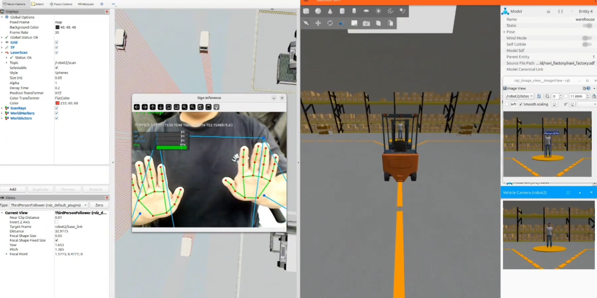
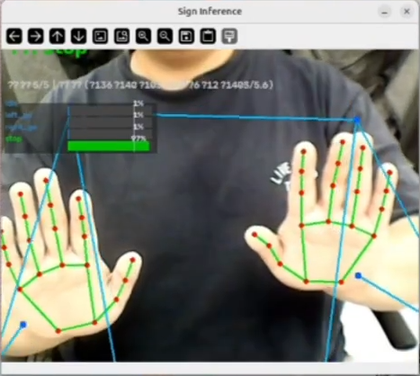
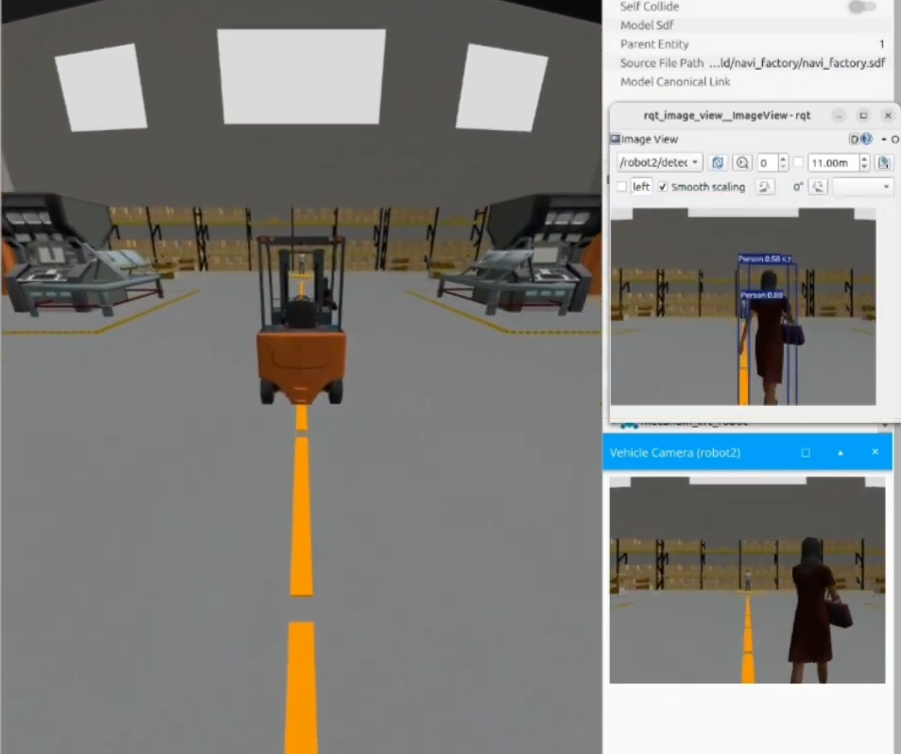
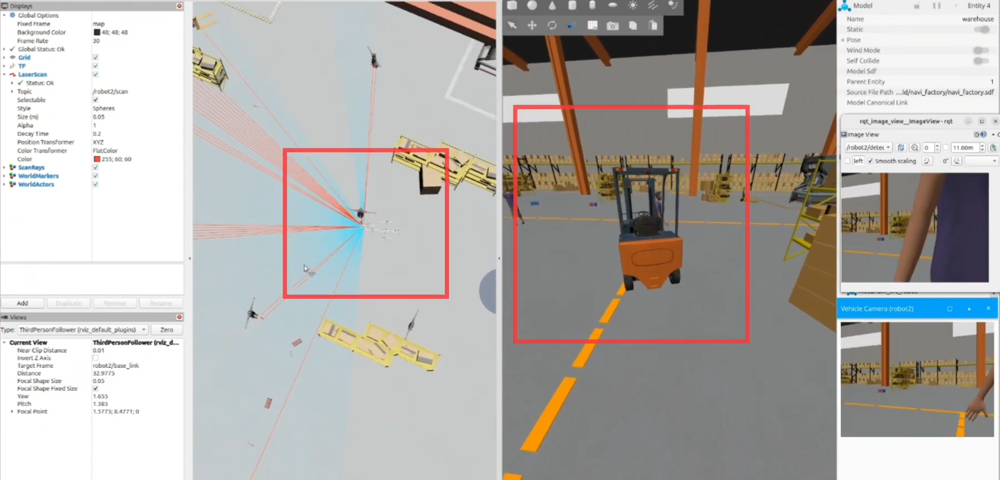

<div align="center">

# K-NAVI

작업자의 **손짓만으로** 물류 로봇을 세우고, 부르고, 돌려 보내는 Gazebo 창고 시뮬레이션


**[▶ 데모 영상 보기](https://youtu.be/uNY5pw-5RxQ)** · 삼성 AXI 1차 팀 프로젝트 · 2026.07 · 5인



<sub>왼쪽: RViz LaserScan · 수신호 인식 창 (stop 97%) / 가운데: Gazebo 창고 / 오른쪽: 로봇 카메라 YOLO 탐지</sub>

</div>

<br/>

공장에서는 신호수의 손동작을 운전자가 놓쳐서 사고가 납니다. K-NAVI는 별도 컨트롤러 없이
**웹캠에 비친 수신호**로 로봇에 명령하고, 로봇은 주행 중 **라이다와 카메라로 장애물**을 보고
스스로 감속하거나 멈춥니다.

설계 원칙은 하나입니다. **인식이 불확실하면 로봇은 선다.** 모델이 무엇을 말하든, 정지를 결정하는
최종 권한은 코드에 있습니다.

## 구조

모델이 맡는 일과 코드가 맡는 일을 층으로 나눴습니다. 위로 갈수록 우선순위가 높습니다.

```
 우선순위 100   LiDAR 비상정지        estop_node        1.5m 안에 장애물이면 무조건 0 속도
 우선순위  50   수신호 명령           Signal-Vision     LSTM + 안정화 필터, rosbridge로 전달
 우선순위  20   수동 조작             teleop
 우선순위  18   LiDAR 감속            estop_node        1.5~5m 구간에서 순찰 속도를 깎음
 우선순위  15   마커 감속             marker_vision
 우선순위  10   자율 순찰             mission_follower  웨이포인트 + 차선 추종
```

모든 명령은 `twist_mux`로 모입니다. 동시에 살아 있으면 우선순위가 높은 쪽이 이기고, 발행이
끊기면 timeout(0.3~0.5초) 뒤 자동으로 빠집니다. 그래서 수신호가 끊기면 순찰이 다시 이어지고,
비상정지는 수신호를 포함한 **모든 명령을 덮습니다.**

| 층 | 누가 하나 | 모델이 하는가 |
|---|---|---|
| 손 · 상체 랜드마크 추출 | MediaPipe | 사전학습 모델 |
| 수신호 분류 (7종) | PyTorch LSTM, 30프레임 시퀀스 | **직접 학습** |
| 분류 결과 확정 | 안정화 필터 (임계값 0.8, 5프레임 연속, EMA 0.4) | 코드 |
| 장애물 종류 인식 | YOLOv8, Gazebo 화면으로 학습 | **직접 학습** |
| 감속 · 정지 판단 | LiDAR 거리 + twist_mux 우선순위 | 코드 |

## 수신호 인식 (Signal-Vision)



산업 수신호는 정지된 자세가 아니라 **팔의 궤적**입니다. 그래서 한 프레임을 분류하지 않고
30프레임 시퀀스를 LSTM으로 분류합니다.

```
웹캠 → MediaPipe 손 21점 × 2 + 상체 8관절 → 150차원 × 30프레임 → LSTM → 안정화 필터 → rosbridge
                 왼손 63 | 오른손 63 | 상체 24
```

- **상체 포즈를 함께 쓰는 이유:** 목장갑을 끼면 손 랜드마크가 흔들립니다. 몸 전체 스케일의 포즈가 이를 보완합니다. 손만 쓰는 126차원 안은 기각했습니다.
- **안정화 필터:** 신뢰도 0.8 이상이 5프레임 연속이어야 명령으로 확정합니다. 확정 전과 사람이 보이지 않을 때는 `unknown`이고, 로봇은 정지합니다.
- **전달:** `/hand_signal` 토픽(std_msgs/String)에 JSON으로 실어 rosbridge 웹소켓으로 보냅니다. 인식기는 macOS · Windows, 시뮬레이터는 Ubuntu VM이라 OS 사이 전송이 가장 단순한 방식을 골랐습니다.

```json
{"signal": "stop", "confidence": 0.93, "timestamp": 1783300000.0}
```

| 라벨 | 동작 | 로봇 행동 |
|---|---|---|
| `stop` | 손바닥을 정면으로 | 즉시 정지 |
| `slow` | 손바닥을 눌러 내리기 | 감속 |
| `come` | 손짓해 부르기 | 접근 |
| `back` | 손등으로 밀어내기 | 후진 |
| `left_go` · `right_go` | 좌 · 우로 팔 젓기 | 선회 |
| `idle` | 평상시 동작 | 직전 상태 유지 |

## 장애물 인식 (Perception)



로봇 카메라 화면에서 YOLOv8로 6종(PalletJack · Bucket · Cluttering · TrashCan · Person · Vehicle)을
탐지합니다. 박스 크기는 LiDAR 거리와 함께 감속 판단의 입력이 됩니다.

학습 데이터는 **로봇이 실제로 보는 Gazebo 렌더러에서 직접 캡처**하고, 라벨은 gz-sim의
`boundingbox_camera`로 자동 계산합니다. COCO 실사진과 Blender 렌더는 시도 후 기각했습니다.

## LiDAR 비상정지



<sub>왼쪽: RViz에서 본 /robot2/scan, 진행 통로의 장애물 / 오른쪽: 같은 순간 Gazebo 지게차 시점</sub>

진행 통로 안의 가장 가까운 장애물 거리로 두 단계 반응합니다. **회피는 하지 않습니다.** 길 위에
사람이 있으면 서고, 지나가면 다시 갑니다.

| 거리 | 반응 | 덮는 명령 |
|---|---|---|
| 5m ~ 1.5m | 순찰 속도를 깎아 재발행 (신호수에게 다가갈 수 있도록) | 순찰 |
| 1.5m 이내 | 0 속도 발행 | 수신호 · 수동 조작 · 순찰 전부 |

## 결과

| 항목 | 결과 |
|---|---|
| 수신호 7종 테스트 정확도 | **93.8%** |
| 악조건 5종 (노이즈 · 가림 · 속도 · 거리 · 렌즈 왜곡) 정확도 하락 | **2%p 이내** |
| 시뮬레이터 화면 탐지 신뢰도 (Blender 학습본 → Gazebo 캡처 학습본) | 0.27 ~ 0.46 → **0.95** |
| 거리 8배 원거리 물체 탐지 신뢰도 | 0건 → **0.89** |
| YOLO 학습 시간 (50 epoch) | 로컬 Mac 32분 → **Kaggle T4 7분** |

### YOLO 학습 라운드별 비교

| 차수 | 변경 | mAP50 | mAP50-95 | 실제 화면에서 확인한 것 |
|---|---|---|---|---|
| 1 | 캡처 거리 확장 | 0.995 | 0.981 | 원거리 물체 탐지 |
| 2 | 여러 물체 · 배경 추가 | 0.968 | 0.922 | 여러 물체 동시 인식 |
| 3 | 실제 창고 월드 캡처 | 0.940 | 0.870 | 없는 물체 오탐 제거 |
| 4 | 학습 해상도 960 | 0.921 | 0.833 | 기둥 오탐 해소 |

**검증 점수는 라운드마다 떨어졌습니다.** 검증셋이 실제 화면처럼 어려워진 결과로 보고, 점수가 아니라
**실제 창고 화면에서의 오탐 · 미탐**을 기준으로 모델을 채택했습니다. 점수만 봤다면 1차 모델을
골랐을 것이고, 그 모델은 창고 기둥을 사람으로 잡습니다.

## 시행착오에서 배운 것

시간을 가장 많이 쓴 건 모델 구조가 아니라 데이터였습니다.

- **수신호를 동작이 아니라 화면 위치로 분류하고 있었습니다.** 랜드마크를 화면 기준 절대좌표로 저장해서, 같은 동작도 서 있는 위치가 다르면 다른 수신호가 됐습니다. 어깨 중심을 원점, 어깨너비를 단위로 정규화했고, 화면 좌표를 전제로 짜여 있던 데이터 증강 코드의 기준점도 함께 고쳤습니다. 하나만 고치면 학습과 추론이 서로 다른 좌표를 봅니다.
- **멀리 있는 물체를 전혀 못 잡았습니다.** 학습 이미지 속 물체가 화면의 30~50% 크기에만 몰려 있었습니다. 거리를 8배로 늘린 재현 테스트에서 탐지 0건이었고, 캡처 거리를 넓혀 5~55% 크기까지 학습한 뒤 같은 테스트에서 0.89가 나왔습니다.
- **재학습했는데 결과가 소수점까지 똑같았습니다.** 데이터셋 분할 폴더를 비우지 않아 이미지가 2,160장에서 3,328장으로 누적됐고, Kaggle 업로드가 끝나기 전에 학습이 시작됐습니다. 지금은 결과가 같으면 가중치 md5와 학습 이미지 수부터 확인합니다.

설계 결정은 배경 · 결정 · 근거 · 기각안 형식으로 **ADR 14건**에 남겼습니다
([decisions.md](https://github.com/SAX-AI-TeamProject1/Signal-transport-perception/blob/deploy/docu/decisions.md)).

## 기술 스택

| 영역 | 사용 기술 | 저장소 |
|---|---|---|
| 수신호 인식 | Python 3.12, MediaPipe Tasks, OpenCV, PyTorch (LSTM) | Signal-Vision |
| 장애물 인식 | YOLOv8 (Ultralytics), OpenCV, Kaggle T4 GPU 학습 | Signal-transport-perception |
| 시뮬레이션 · 제어 | ROS 2 Jazzy, Gazebo Harmonic, twist_mux, RViz2 | Signal-Simulation |
| 통신 | rosbridge (WebSocket), std_msgs/String JSON | Signal-Vision → Signal-Simulation |
| 배포 · 협업 | 버전 태그가 붙은 pip 패키지(인식 모듈), Git, Jira | 전체 |

## 저장소

| 저장소 | 역할 |
|---|---|
| [Signal-Vision](https://github.com/SAX-AI-TeamProject1/Signal-Vision) | 웹캠 → MediaPipe 손 · 포즈 랜드마크 → LSTM 수신호 분류 → rosbridge 발행 |
| [Signal-transport-perception](https://github.com/SAX-AI-TeamProject1/Signal-transport-perception) | Gazebo 캡처 데이터셋 · 자동 라벨링 · YOLOv8 학습, 인식 모듈 pip 패키지 |
| [Signal-Simulation](https://github.com/SAX-AI-TeamProject1/Signal-Simulation) | ROS 2 + Gazebo 창고 월드, twist_mux 명령 중재, LiDAR 비상정지, 자율 순찰 |
| [Industrial-data](https://github.com/SAX-AI-TeamProject1/Industrial-data) | 학습 · 검증용 데이터셋 |

<div align="center">
<br/>

**[▶ 데모 영상](https://youtu.be/uNY5pw-5RxQ)**

</div>
